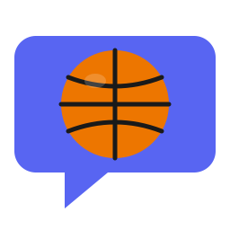

<p align="center">
  
</p>

<h1 align="center">NBA Discord Agent</h1>

<p align="center">
  <a href="https://github.com/labeveryday/nba-discord-agent/actions/workflows/ci.yml"></a>
  <a href="https://github.com/labeveryday/nba-discord-agent/actions/workflows/codeql.yml"></a>
  
  
</p>

A Discord bot that answers NBA questions (scores, stats, standings, schedules, player info) and posts proactive game-day content. Built with [Strands Agents](https://github.com/strands-agents/sdk-python) and the [`nba-stats-mcp`](https://pypi.org/project/nba-stats-mcp/) MCP server.

It supports three model backends out of the box — **Ollama** (local, default), **Anthropic**, and **OpenAI** — selected with a single `MODEL_PROVIDER` env var. No code changes needed to switch.

Created by [Du'An Lightfoot](https://duanlightfoot.com) ([@labeveryday](https://github.com/labeveryday))

---

## Features

- **Ask anything NBA** — `$nba <question>`, `@mention`, reply, or DM the bot
- **Per-conversation memory** — separate context per thread / user / DM
- **Proactive heartbeat** (optional) — morning recaps, game previews, auto-created game threads, post-game highlights, weekly standings
- **Pluggable models** — Ollama (default, local), Anthropic, or OpenAI via one env var
- **Local-first** — runs on Ollama with `qwen3:4b` by default; no cloud bill

---

## Prerequisites

- Python 3.11+ **or** Docker + Docker Compose
- A Discord bot token — create one at the [Discord Developer Portal](https://discord.com/developers/applications) (enable the **Message Content Intent** under **Bot → Privileged Gateway Intents**)
- One model backend:
  - **Ollama** (default) — install from [ollama.com](https://ollama.com), then `ollama pull qwen3:4b`
  - **Anthropic** — an `ANTHROPIC_API_KEY` from [console.anthropic.com](https://console.anthropic.com)
  - **OpenAI** — an `OPENAI_API_KEY` from [platform.openai.com](https://platform.openai.com)

---

## Quick start (Docker — recommended)

```bash
# 1. Clone
git clone https://github.com/labeveryday/nba-discord-agent.git
cd nba-discord-agent

# 2. Configure
cp env.example .env
# Open .env and set DISCORD_TOKEN (and optionally HEARTBEAT_CHANNEL_ID)
chmod 600 .env

# 3. Run
docker compose up -d --build

# 4. Tail logs
docker compose logs -f
```

The container talks to Ollama on the host via `host.docker.internal:11434`. If Ollama only listens on `127.0.0.1`, see [Exposing Ollama to Docker](#exposing-ollama-to-docker) below.

## Quick start (without Docker)

```bash
git clone https://github.com/labeveryday/nba-discord-agent.git
cd nba-discord-agent

python -m venv .venv
source .venv/bin/activate
pip install -r requirements.txt

cp env.example .env
# Edit .env and set DISCORD_TOKEN

python src/agent.py
```

`nba-stats-mcp` is installed automatically as a dependency and launched over stdio. To run it via `uvx` instead, set `NBA_MCP_USE_UVX=true` in `.env`.

---

## Talking to the bot

| Trigger | Example |
|---|---|
| Command | `$nba who scored the most last night?` |
| Mention | `@NBA Bot standings in the East` |
| Reply | reply to one of the bot's messages to continue the thread |
| DM | message the bot directly — no prefix needed |
| Help | `$help` |
| Health | `$status` |

---

## Configuration

All settings are environment variables. Copy `env.example` → `.env` and edit.

**Core**

| Variable | Required | Default | Description |
|---|---|---|---|
| `DISCORD_TOKEN` | ✅ | — | Discord bot token |
| `MODEL_PROVIDER` |  | `ollama` | Backend: `ollama`, `anthropic`, or `openai` |
| `MODEL_TEMPERATURE` |  | `0.6` | Sampling temperature (applies to all providers) |

**Ollama** (when `MODEL_PROVIDER=ollama`)

| Variable | Default | Description |
|---|---|---|
| `OLLAMA_HOST` | `http://localhost:11434` (`http://host.docker.internal:11434` in Docker) | Ollama server URL |
| `OLLAMA_MODEL` | `qwen3:4b` | Ollama model id |

**Anthropic** (when `MODEL_PROVIDER=anthropic`)

| Variable | Default | Description |
|---|---|---|
| `ANTHROPIC_API_KEY` | — | **Required.** API key from console.anthropic.com |
| `ANTHROPIC_MODEL` | `claude-haiku-4-5-20251001` | Model id |
| `ANTHROPIC_MAX_TOKENS` | `4000` | Max output tokens |

**OpenAI** (when `MODEL_PROVIDER=openai`)

| Variable | Default | Description |
|---|---|---|
| `OPENAI_API_KEY` | — | **Required.** API key from platform.openai.com |
| `OPENAI_MODEL` | `gpt-5-mini-2025-08-07` | Model id |
| `OPENAI_MAX_TOKENS` | `16000` | Max completion tokens |

**MCP / heartbeat / alerts**

| Variable | Default | Description |
|---|---|---|
| `NBA_MCP_USE_UVX` | `false` | Run `nba-stats-mcp` via `uvx` instead of the installed entry point |
| `NBA_MCP_COMMAND` | `nba-stats-mcp` | Override the MCP server command |
| `NBA_MCP_ARGS` | — | Extra args for the MCP server (shlex-split) |
| `HEARTBEAT_ENABLED` | `true` | Master switch for proactive posts |
| `HEARTBEAT_CHANNEL_ID` | — | Channel ID for daily recaps / previews / standings (heartbeat is off until set) |
| `GAME_THREAD_CHANNEL_ID` | = `HEARTBEAT_CHANNEL_ID` | Channel where game-day threads are created |
| `ALERTS_WEBHOOK_URL` | — | Discord webhook for startup / error alerts (optional) |

To get a channel ID: enable **Settings → Advanced → Developer Mode** in Discord, then right-click a channel → **Copy Channel ID**.

---

## Heartbeat (proactive posts)

When `HEARTBEAT_CHANNEL_ID` is set, a background task wakes up every minute and posts:

| Job | Schedule (ET) | What it does |
|---|---|---|
| Morning recap | 9:00 AM daily | Last night's scores + top performers |
| Game preview | 11:00 AM daily | Today's matchups and tip times |
| Game threads | 11:00 AM daily | Creates a Discord thread per game |
| Post-game highlights | every 15 min during games | Box score summary when a game goes Final |
| Weekly standings | Mon 10:00 AM | East/West standings with streaks |

State is stored in SQLite (`/app/data/agent.db` in Docker), so jobs are idempotent and survive restarts. When a user asks a question, interactive replies always preempt heartbeat work.

Disable it any time with `HEARTBEAT_ENABLED=false`.

---

## Switching model providers

Pick one provider in `.env` — no code changes needed.

```bash
# Local (default)
MODEL_PROVIDER=ollama
OLLAMA_MODEL=qwen3:4b

# Anthropic
MODEL_PROVIDER=anthropic
ANTHROPIC_API_KEY=sk-ant-...
ANTHROPIC_MODEL=claude-haiku-4-5-20251001

# OpenAI
MODEL_PROVIDER=openai
OPENAI_API_KEY=sk-...
OPENAI_MODEL=gpt-5-mini-2025-08-07
```

Restart the bot after changing. Want to add another Strands-supported provider (Bedrock, Gemini, Writer, etc.)? Add a factory in `src/models/models.py` and register it in the `PROVIDERS` dict.

---

## Exposing Ollama to Docker

If you run Ollama on the host and the container can't reach it, expose Ollama on all interfaces:

```bash
sudo systemctl edit ollama.service
```

Add:

```ini
[Service]
Environment="OLLAMA_HOST=0.0.0.0:11434"
```

Restart and lock the port down to localhost + Docker only:

```bash
sudo systemctl daemon-reload
sudo systemctl restart ollama

sudo iptables -A INPUT -p tcp --dport 11434 -s 127.0.0.0/8 -j ACCEPT
sudo iptables -A INPUT -p tcp --dport 11434 -s 172.16.0.0/12 -j ACCEPT
sudo iptables -A INPUT -p tcp --dport 11434 -j DROP
```

---

## Security

The Docker image runs as a non-root user, with a read-only filesystem, all capabilities dropped, `no-new-privileges`, and 768 MB / 1 CPU limits. Per-user rate limit is 5 seconds.

If you ever leak `DISCORD_TOKEN`, rotate it in the [Discord Developer Portal](https://discord.com/developers/applications) → your app → **Bot** → **Reset Token**. To rotate `ALERTS_WEBHOOK_URL`, delete the old webhook in the channel's **Integrations → Webhooks** and create a new one (webhook URLs cannot be reset, only replaced).

---

## Project layout

```
src/
├── agent.py            # Entrypoint — Discord client + Strands agent wiring
├── heartbeat.py        # Proactive scheduler (recaps, previews, threads, standings)
├── alerts.py           # Optional Discord webhook alerts
├── config/
│   └── prompts.py      # System prompt builder
├── models/
│   └── models.py       # Ollama / Anthropic / OpenAI factories + build_model()
└── hooks/
    └── nba_tool_hooks.py   # Strands tool hooks (strip IDs/URLs from MCP results)
Dockerfile
docker-compose.yml
env.example             # Copy to .env
requirements.txt
```

---

## License

MIT — see [LICENSE](LICENSE).

Built by **Du'An Lightfoot** • [duanlightfoot.com](https://duanlightfoot.com) • [YouTube: LabEveryday](https://youtube.com/@labeveryday)
